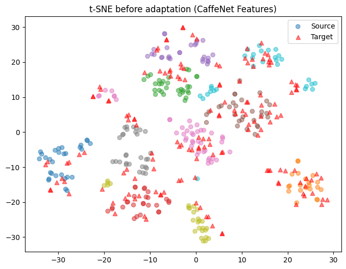
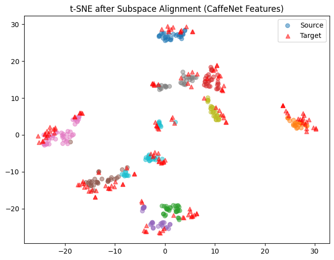
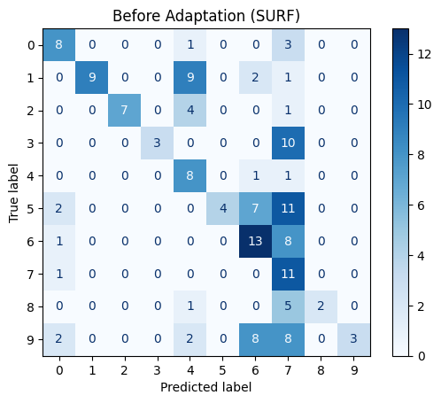
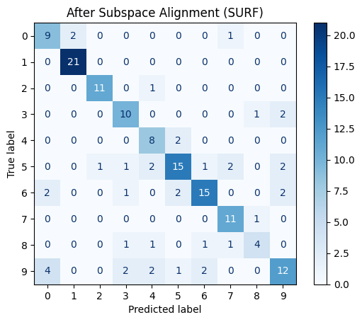
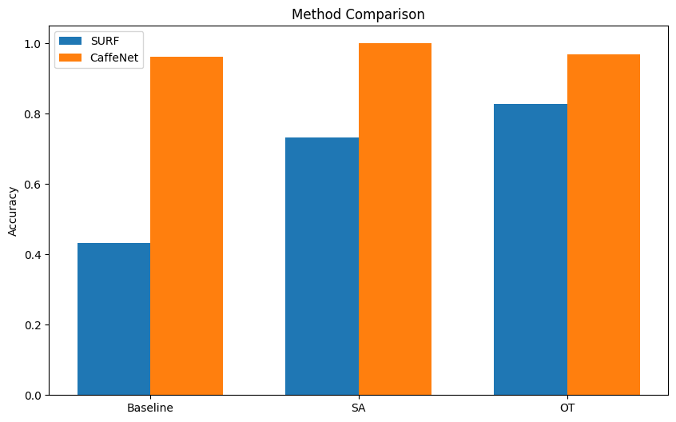

# A Comparative Analysis of Subspace Alignment and Optimal Transport for Unsupervised Domain Adaptation

## Project Overview

This research project explores the effectiveness of domain adaptation techniques in computer vision, specifically comparing Subspace Alignment (SA) and Optimal Transport (OT) methods. The study focuses on unsupervised domain adaptation using the Office/Caltech dataset, examining the transfer of learning between webcam and DSLR camera domains. The work demonstrates the practical applications of these methods in real-world scenarios where labeled data might be scarce in target domains.

## Research Findings

The performance of each method varied significantly based on the type of features used. When working with SURF features, which are 800-dimensional representations, OT demonstrated superior performance with an accuracy of 82.80%, while SA achieved 73.25%. These results represent substantial improvements over the baseline accuracy of 43.31%. 

The situation changed dramatically when using CaffeNet features, which are 4096-dimensional deep learning representations. In this case, SA achieved perfect adaptation with 100% accuracy, while OT performed slightly lower at 96.82%. The baseline performance with CaffeNet features was already strong at 96.18%, indicating the high quality of these representations.

Computational efficiency analysis revealed interesting trade-offs. SA maintained consistent performance times around 0.09 seconds regardless of feature dimensionality. In contrast, OT's computational cost scaled with feature dimension, requiring 0.07 seconds for SURF features but increasing to 0.34 seconds for CaffeNet features. This scaling behavior becomes particularly relevant when considering real-world applications with high-dimensional data.


## Technical Implementation

The implementation began with careful preprocessing of the Office/Caltech dataset, focusing on the challenging Webcam to DSLR adaptation task. Data normalization employed z-score scaling using only source domain statistics to maintain the unsupervised nature of the adaptation. Feature extraction utilized both SURF descriptors for traditional computer vision representation and CaffeNet features for deep learning-based representation.

The Subspace Alignment method works by learning a transformation that aligns the principal components of source and target domains. The implementation includes careful dimensionality reduction through PCA and employs a 1-nearest neighbor classifier for final prediction. This approach proved particularly effective with high-dimensional, well-structured features.

The Optimal Transport implementation uses the Sinkhorn algorithm with entropy regularization to find an optimal mapping between domains. This method balances the transportation cost with regularization strength, proving especially effective with lower-dimensional features. The implementation required careful tuning of the regularization parameter to achieve optimal performance.


<p align="center">
  
  
</p>

<p align="center">
  
  
</p>
<p align="center">
  <em>Before Adaptation &nbsp; &nbsp; &nbsp; &nbsp; &nbsp; &nbsp; &nbsp; &nbsp; After Adaptation</em>
</p>

T-SNE visualizations reveal how both methods improve domain alignment while preserving class structure. Confusion matrices show the detailed classification performance across different classes, highlighting where each method excels or struggles.

## Validation Strategy: Reverse Cross-Validation

The biggest challenge in unsupervised domain adaptation is this: How do we choose the best parameters for our adaptation method when we can't see any labels in our target domain? Think of it like trying to tune a radio without being able to hear the output - we need a clever way to know when we've got it right.

Our solution introduces a reverse validation strategy that works like this:

```text
Input: 
- Source Data (S) with labels (ys)    Example: Webcam images with known object labels
- Target Data (T) without labels      Example: DSLR images without labels
- Parameter Range (Θ)                 Example: SA: dimension d [10,20,...], OT: λ [10⁻²,10²]

Process for each parameter θ:
1. Split source data into 10 folds (StratifiedKFold)
2. For each fold:
   - Use part of source data for training (Strain)
   - Keep part for validation (Sval)
   - Adapt training data to target domain (Sadapted)
   - Predict pseudo-labels for target data
   - Validate by reversing the direction
   - Score this parameter

Output:
- Best parameter θ* based on mean validation scores
```

1. Never uses target labels during adaptation
2. Works for both SA (choosing subspace dimension) and OT (choosing regularization strength)
3. Maintains true unsupervised conditions
4. Uses cross-validation to ensure robust parameter selection

How we practically apply this:
- SA: We test dimensions from 10 up to min(source_samples, target_samples) - 1
- OT: We explore regularization values from 0.01 to 100
- Both methods use a simple 1-nearest neighbor classifier for prediction

This strategy effectively solves the parameter selection problem while maintaining the real-world applicability of our methods.

<p align="center">
  
</p>

Required dependencies:
```python
numpy==2.1.1             
scikit-learn==1.5.2      
POT==0.9.4              # For Optimal Transport computations
pandas==2.2.2           
matplotlib==3.9.2       
seaborn==0.13.2         
scipy==1.14.1           # For scientific computations
```

## Future Research Directions

Future work could explore integration with modern deep learning frameworks, extending to multi-source domain adaptation scenarios. Development of real-time adaptation capabilities would open new application possibilities. Extended feature comparison could provide deeper insights into method behavior across different representation types.

## References
- [Fernando et al. (2013): Subspace Alignment for Domain Adaptation](https://arxiv.org/abs/1409.5241)
- [Courty et al. (2016): Optimal Transport for Domain Adaptation](https://arxiv.org/abs/1603.08788)
